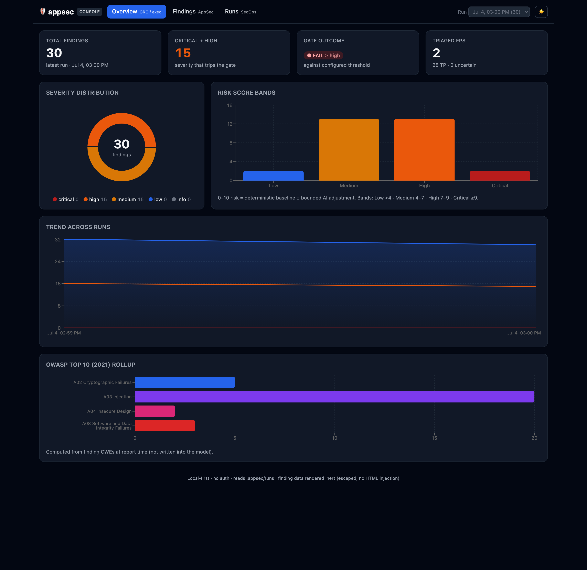
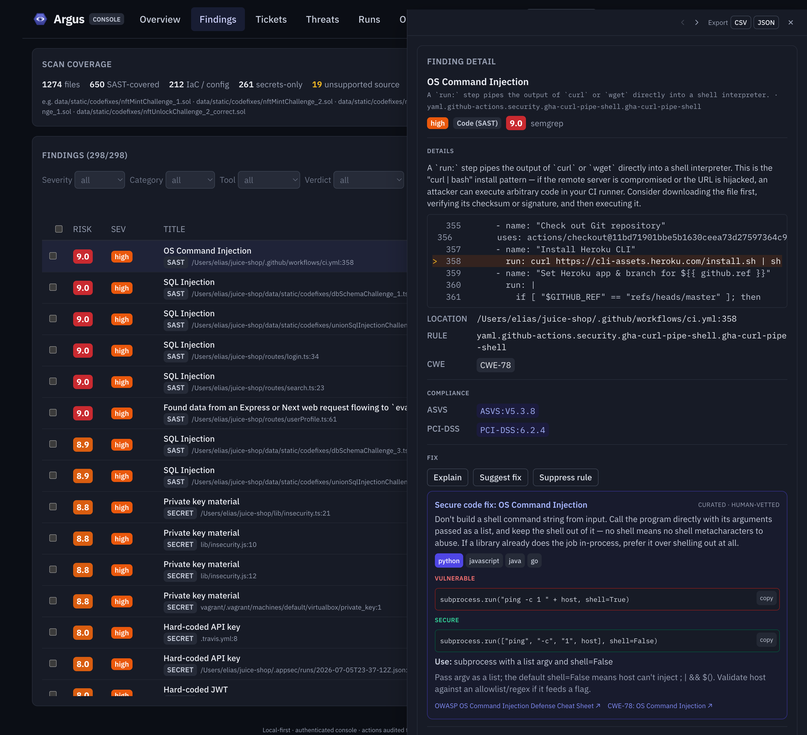
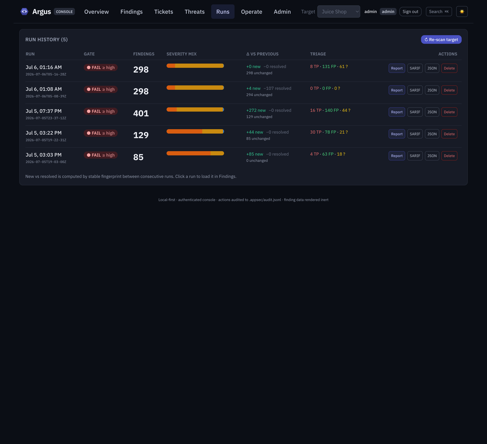
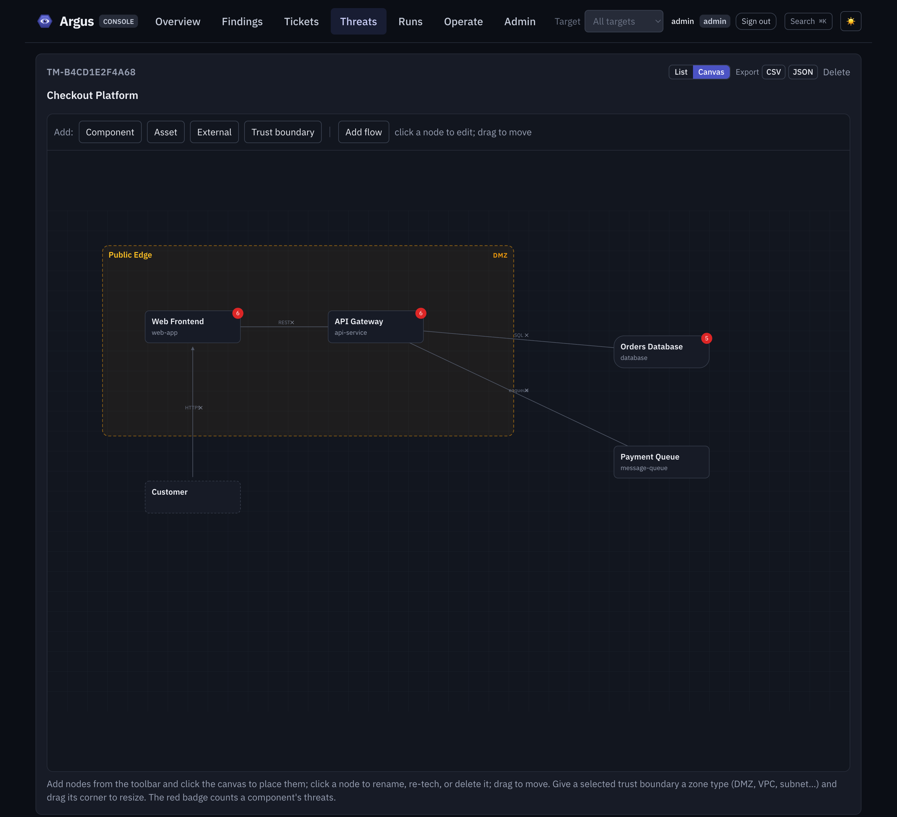

<h1 align="center">
  
  Argus
</h1>

<p align="center"><strong>The all-seeing watch over your code and the cloud it runs in.</strong></p>

<p align="center">From a student scanning a class project to an enterprise with SSO and an audit trail,<br/>the same binary, local-first and free at the core.</p>

<p align="center">
  
  
  
  
</p>

**One security tool for the whole surface: code and the cloud it runs in.**
Argus runs open-source scanners against your repositories and your cloud
accounts, merges everything into one deduplicated, risk-scored,
compliance-mapped findings model, AI-triages each finding on your own machine,
gates CI on severity, and serves a web console over your run history, all from
a single Go binary. Many scanners, one all-seeing view: their output merged
into a single findings model.

<p align="center"></p>

**Everything, one model.** SAST across **thirteen languages** (Python,
JavaScript, TypeScript, Go, Java, C#, Ruby, PHP, Kotlin, Rust, Scala, C,
Swift), secrets, dependencies (SCA), **IaC misconfiguration**
(Terraform, CloudFormation, Kubernetes, Dockerfile, Helm, plus Bicep/ARM and
Pulumi for architecture detection), **cloud security posture** (prowler:
AWS, Azure, GCP), **DAST** (nuclei: `argus dast <url>` against a running
target, see [docs/dast.md](docs/dast.md)), and **container images**
(`argus image <ref>`, trivy, see [docs/image.md](docs/image.md)) all flow
through the same banded severity, risk signals, and compliance mapping. Plus
**SBOM generation** (`argus sbom` in CycloneDX or SPDX, see
[docs/sbom.md](docs/sbom.md)) from the same dependency inventory.

**Findings become audit evidence.** Every finding is mapped (deterministically,
no LLM) to the framework controls it violates (**OWASP ASVS 4.0**,
**PCI DSS 4.0**, and **CIS** AWS/Docker/Kubernetes benchmarks), and
`argus comply` turns any scan into a per-framework gap report a GRC lead can
hand to an auditor: controls violated with evidence, controls with no
violations detected, and an explicit "not assessable by static scanning"
bucket so the report never overclaims ([docs/compliance.md](docs/compliance.md)).

```
argus scan ./repo --profile standard --triage --save
  → runs in parallel:  semgrep (SAST) · gitleaks (secrets) · trivy (SCA) · checkov + trivy-config (IaC)
  → normalizes everything into one findings model
  → dedups/correlates overlapping findings
  → AI triage (local Ollama): LLM verdicts true/false-positive per finding
  → risk-scores every finding 0–10 (heuristic baseline ± bounded LLM adjustment)
  → maps every finding to ASVS / PCI DSS / CIS controls (deterministic, no LLM)
  → writes SARIF 2.1.0 / Markdown / JSON, saves the run for the console
  → exits non-zero when findings hit your severity gate

argus comply  → per-framework compliance gap report: violated / clean / not assessable
argus serve   → local web console: Overview, Findings, Runs, and more
                 + with users configured: login, scan launching, admin, audit
argus user    → console users: add | list | passwd | remove (bootstrap the first admin)
argus target  → registered scan targets the console may launch against
argus ticket  → work items over findings: create | list | show | link | comment
argus threats → threat models: list | show | STRIDE library | enumerate
```

## Why Argus exists

A good application-security program has mostly been a privilege of teams that
could afford one. The scanners that matter sit behind enterprise sales calls and
per-seat pricing; the ones that don't usually want your source uploaded to
someone else's cloud before they'll tell you what's wrong with it. If you're a
student, a two-person shop, or a team that can't send its code offsite, you've
been priced or policied out of the thing everyone calls table stakes.

That never sat right. Security is the baseline, not an upsell, and the people
with the least budget are often the ones getting breached. So Argus runs on a
stubborn premise: the core is free, and it works entirely on your machine. Your
code, your findings, and the local model that triages them stay put; nothing
phones home, nothing gets uploaded, and you start without an account. The pieces
a bigger org needs later (SSO, roles, an audit trail) are layers you switch on,
never a paywall in front of the scanner.

Free and private aren't the compromise. They're the whole idea.

## Who it's for

The same binary meets you where you are, and grows as you do:

- **Students & learners**: scan a project on your laptop, free and local, no
  account, and see real findings mapped to real weakness classes.
- **IT shops & solo builders**: one command in CI, a severity gate, and a
  console anyone can read. Nothing to host, no per-seat bill.
- **Startups**: code and cloud in one view, compliance evidence for the first
  audit conversation, and triage that keeps the noise survivable.
- **Enterprises**: SSO, role-based access, an audit trail, approved
  remediation, and gap reports a GRC lead can hand to an auditor.

Local-first and free at the core; the controls a larger team needs are layers
you turn on. Where SSO and approved cloud remediation are headed:
[docs/roadmap-platform.md](docs/roadmap-platform.md).

## The console

`argus serve` reads the runs you save and renders them across seven tabs:
Overview, Findings, Runs, **Tickets**, **Threats**, Operate, and Admin. Finding
data (titles, paths, LLM rationales) is treated as hostile and rendered inert:
escaping only, no HTML injection, strict CSP, binds `127.0.0.1`.

Out of the box the console is a read-only viewer with no login. Create users
(`argus user add <name> --role admin`) and it becomes an **operational
console**: login + roles (viewer/operator/admin), scan launching against
registered targets (`argus target add`) through a strictly serial job queue,
user management, **detection-rule management** (enable rule packs, bring or
AI-author custom rules), and an append-only audit log. Threat model and design:
[docs/console-ops.md](docs/console-ops.md).

| Overview | Findings | Runs |
|---|---|---|
|  |  |  |

Risk posture, severity/OWASP rollups, per-framework compliance posture, and a
cross-run trend for leadership; a filterable explorer with per-finding triage
rationale and violated-control chips for engineers; new-vs-resolved deltas,
a **baseline picker** (compare a run against any earlier one, with a "new only"
filter), and gate outcomes for operations.

## From findings to work: tickets and threat models

Scanning tells you what's wrong. Two pillars, both backed by an embedded SQLite
database (`argus.db`, opened on `serve`), turn that into tracked work, and
neither ever touches the gate.

<p align="center"></p>

**Ticketing** is the work layer over findings. A ticket gathers evidence (many
findings by stable fingerprint), carries a comment-and-event timeline, and
computes a severity rollup at read time so it never goes stale. Filter by
status, assignee, or priority; see how long a ticket has been open and whether
it's overdue; assign from a roster with autocomplete. Closing a ticket "done"
can write a `fixed` disposition for its linked findings: the one, explicit,
audited bridge to the gate, and it refuses to overwrite a human's accepted-risk
or false-positive call. Opt-in [GitHub Issues sync](docs/console-ops.md)
(config-gated, off by default) creates or links an issue, storing only the URL
and number; the token is referenced by env-var name, never stored.

**Threat modeling** is STRIDE over your architecture. Add components (or
generate a baseline from the repo's IaC: Terraform, CloudFormation,
Kubernetes, Bicep, ARM, Pulumi, Helm), and Argus enumerates curated STRIDE
threats from a version-pinned library per component tech: deterministic, no
model in the loop. A local LLM can additionally *suggest* components and
threats from the repo layout, each labeled `assisted` and confirmed by a human
before it counts. Threats link to real findings, compliance controls, and
mitigations. A full-width **canvas editor** lets you map the architecture
directly: add components, assets, external entities, and trust boundaries,
each boundary typed by zone (DMZ, VPC, subnet, on-prem, internet, cloud
account, Kubernetes), rename or re-type them, resize a boundary to hold what
it contains, and draw data flows between nodes; positions and geometry persist
per model. Export a model's threats to CSV or JSON.

<p align="center"></p>

The rule both pillars live by: **a ticket or a threat never moves a severity or
a gate outcome.** The gate reads file-based dispositions; the database owns work
state, not the CI decision.

## Quickstart (90 seconds)

```bash
# One command builds the binary and reports which scanners you have:
./scripts/setup.sh

# Or by hand, prereqs: Go 1.22+, plus whichever scanners you want on PATH:
#   pipx install semgrep     (or: pip install semgrep)
#   brew install gitleaks trivy   # trivy covers SCA *and* IaC misconfigs
#   pipx install checkov          # optional: the broad IaC engine
go build -o argus ./cmd/argus        # embeds the console; no Node needed to run

# Scan with the default `standard` multi-language profile, triage locally,
# and save the run for the console:
./argus scan . --triage --save

# Open the console over your saved runs:
./argus serve                          # http://127.0.0.1:8080

# Other common invocations:
./argus scan . --profile fast          # tight, low-noise PR gate (semgrep p/ci)
./argus scan . --profile max           # deepest recall; triage handles the FP volume
./argus scan . --format sarif -o results.sarif   # GitHub code scanning
./argus scan . --fail-severity high    # fail CI on high or critical
./argus scan . --triage --exclude-fp   # drop LLM-marked false positives (explicit)
./argus comply .                       # compliance gap report (fresh scan, Markdown)
./argus comply . --latest -f json      # assess the last saved run instead
```

## Cloud security posture (prowler)

Point the platform at an AWS account and get a posture assessment through the
**same** pipeline as code: unified findings (category `CLOUD`), banded
severity, deterministic risk signals, and CIS-AWS compliance mapping, skimmable
in the console.

```bash
# Prereq: prowler on PATH (`pipx install prowler`) and a read-only profile.
./argus cloud-scan --provider aws --profile security-audit
./argus cloud-scan --provider aws --profile security-audit --regions us-east-1,us-west-2 --save
```

**Credentials are referenced, never collected.** `--profile` names a profile
from your local cloud config (`~/.aws`); the platform passes only that NAME to
prowler as `AWS_PROFILE` and never sees, stores, or logs a key. Least-privilege
setup: create a read-only security-audit principal and point `--profile` at it:

```bash
# AWS: attach the two AWS-managed read-only policies to a dedicated principal.
aws iam create-user --user-name argus-audit
aws iam attach-user-policy --user-name argus-audit \
  --policy-arn arn:aws:iam::aws:policy/SecurityAudit
aws iam attach-user-policy --user-name argus-audit \
  --policy-arn arn:aws:iam::aws:policy/job-function/ViewOnlyAccess
# Put its keys in a named profile in ~/.aws/credentials, e.g. [security-audit],
# then reference that NAME. The platform runs with exactly what that profile
# can do: least privilege is your control, honesty about it is ours.
```

**Azure and GCP** work the same way. Register an Azure target by its
subscription id (auth via a `Reader` service principal in the serve
environment) or a GCP target by its project id (auth via `Viewer` Application
Default Credentials); the account id is a reference, never a key, and the
credential lives only in the environment prowler inherits. AWS uses a named
`~/.aws` profile as before. In the console, an admin registers a cloud target
by provider and account reference (never a key); cloud runs appear in the
aggregated Runs tab with a resource-aware finding drawer and an optional
on-demand,
never-persisted **AI posture summary**.

Every cloud finding also carries prowler's own **per-finding compliance
mapping** (the exact controls it violates across NIST-CSF, ISO-27001, PCI,
SOC2, HIPAA, GDPR, MITRE ATT&CK, FedRAMP and more) passed through verbatim
and version-pinned, on top of the gap-reportable CIS-AWS mapping.

## AI-assisted remediation

From any finding, an operator can ask for an **assisted remediation**: a
concrete, category-aware fix to review and run. Cloud findings get a scoped
`aws`/`az`/`gcloud` script targeting the exact resource; code findings a
before→after patch; dependencies the upgrade command; secrets rotation steps.

It is **assisted, never automated**: Argus generates a script the *you* run
with your own credentials; it never executes anything, never holds a write
credential, and never marks a finding "fixed" (only a re-scan clears it, so
every remediation ends with a verification step). A **deterministic safety
linter** runs before anything reaches the browser: a destructive command
(delete/terminate, `drop table`, `rm -rf`, allow-all) or an embedded
credential is withheld, the human steps kept, with a warning. Safe by
degradation. It's an on-demand, never-persisted local-LLM seam, labeled
AI-generated in the UI.

Missing scanners are skipped with a note; the CLI degrades gracefully and
runs whatever the environment provides. The same applies to triage: no LLM
reachable means the scan simply runs without verdicts.

## Scan profiles & coverage

`--profile fast|standard|max` (config: `profile:`) selects the curated semgrep
ruleset. `standard` is the default: a security-audit + OWASP base, a per-language
pack for all thirteen languages, and the **`argus/curated` local ruleset**: the
platform's own rules for weaknesses the registry packs miss (SSRF, XXE, path
traversal, open redirect, unsafe deserialization, weak crypto, LDAP injection,
disabled TLS verification, and more). Coverage is **proven, not claimed**:
labeled fixtures (`testdata/polyglot/`) and a network-dependent test assert every
canary and every curated rule catches a plant the registry packs miss, and
[docs/coverage.md](docs/coverage.md) is a generated language × weakness matrix.
Breadth raises false-positive volume on purpose: local AI triage is the answer.

**Extend the detection, three ways** (admin, in the console's Detection rules
tab, or via `semgrep_rulesets:` in `appsec.yml`):

- **Bring your own rules**: point at registry packs or local rule files/dirs;
  they add to the profile (or replace it), validated before a scan uses them.
- **A rule-pack catalog**: browse and one-click enable vetted semgrep packs
  grouped by language, framework, cloud stack, and weakness class.
- **AI-assisted authoring**: describe a detection in plain language, a local
  LLM drafts a semgrep rule, you validate and test it against an example, then
  save it. A deterministic gate rejects catastrophic-backtracking and
  match-everything rules; nothing runs until you confirm.

Prefer [Opengrep](https://github.com/opengrep/opengrep) (the community Semgrep
fork)? It is a drop-in: install it and Argus uses it automatically, or set
`ARGUS_SEMGREP_BINARY=opengrep`.

**Air-gapped?** The registry packs are the one part that resolves over the
network. Run `argus rules sync` once while online to cache them, then
`argus scan --offline` (or `offline: true`) uses only local sources (the
embedded curated rules, the cached packs, and any local BYO rules) and never
touches the network. Even with an empty cache, an offline scan still runs the
embedded curated rules.

**Adoptable in CI:** a repo with a backlog can gate on only what a change
*adds*. `argus scan --write-baseline .argus-baseline.json` records today's
findings; `argus scan --baseline .argus-baseline.json` then reports everything
but fails the build only on findings new since the baseline. The console makes
the same diff interactive: pick any earlier run as the baseline and filter to
just the new findings. Add `--pr-comments` and the same delta lands on the
pull request as one batched review: inline on the changed lines where GitHub
allows it, the rest in the review body, idempotent across re-pushes, and
always advisory (the exit code belongs to the gate). See
[docs/pr-comments.md](docs/pr-comments.md). And `--diff-base origin/main`
scans only the files the PR changed (merge-base aware, identical
fingerprints to a full scan, full-scan fallback on any git trouble), turning
the PR loop from minutes into seconds. The whole loop is one copy-paste
workflow file: [docs/ci.md](docs/ci.md) walks through
[`examples/github-actions/argus-security.yml`](examples/github-actions/argus-security.yml).

The same bar applies to IaC: labeled misconfigured Terraform / Kubernetes /
Dockerfile fixtures (`testdata/iac/`) with a coverage test asserting every
planted misconfiguration is detected. IaC engines run whenever they are on
PATH (`--profile` tunes semgrep only); every IaC finding lands in the same
model (triaged, risk-scored, gated, and rolled up to OWASP A05) and wears a
category badge in the console.

## Compliance mapping & gap assessment

Every scan maps every finding to the security controls it violates:
hand-curated, version-pinned data (`internal/compliance/data/`), zero LLM
involvement, unmapped-is-visible, totals reconcile. `argus comply` renders the
per-framework gap assessment (Markdown or JSON): **violated** controls with
evidence pointers, **no violations detected** (deliberately not "compliant"),
and an explicit **not assessable by static scanning** bucket. Adding a
framework (SOC 2, NIST 800-53, ISO 27001 are next) is a data-only change:
philosophy, honest-scope statement, and a how-to in
[docs/compliance.md](docs/compliance.md).

## AI triage & risk scoring

Every finding always gets a deterministic **risk score** (0–10; formula in
[docs/risk-scoring.md](docs/risk-scoring.md)), and since schema 2.0.0 its
**severity is banded from the deterministic part of that score** (canonical
bands in the same doc), so "high" means the same thing on every finding from
every tool, context signals included, LLM excluded. The tool's own opinion is
preserved as `toolSeverity`. For dependency CVEs the score is enriched with
real-world exploitation evidence: membership in **CISA's KEV catalog** (embedded
and version-pinned, so it works offline) and **FIRST EPSS** probability (an
optional local file), so a known-exploited vulnerability outranks one that
merely exists. With `--triage` (or
`triage.enabled: true`), an LLM additionally reviews each finding with a
bounded source snippet and records a verdict (`true-positive`,
`false-positive`, or `uncertain`) plus a rationale, which reporters surface
alongside the score. Verdicts are additive metadata: severity and the CI gate
never move on LLM output, and `--exclude-fp` is the only (explicit, counted)
way a verdict removes a finding from the report and gate.

Providers: **Ollama** (default, local) and **Anthropic** (set
`ANTHROPIC_API_KEY`; keys are env-only, never config). Scanned code is treated
as hostile input: snippets enter prompts only inside per-request random
boundary markers, model output is schema-validated, and SECRET findings never
leave the machine unless `allow_secret_cloud: true` is set.

## Configuration: `appsec.yml`

Looked up in the working directory (override with `--config`); flags beat file
values.

```yaml
scanners: []            # subset to run, e.g. [semgrep, gitleaks]; empty = all
profile: standard       # fast | standard | max: the curated semgrep ruleset
semgrep_rulesets: []    # optional: registry packs, argus/curated, or local rule
                        # files/dirs. A leading "+" adds to the profile; no "+"
                        # replaces it. Local paths are validated before use.
fail_severity: high     # critical | high | medium | low | info | none
format: markdown        # sarif | markdown | json
ignore_paths:           # glob patterns; `dir/**` ignores a subtree
  - testdata/**
  - vendor
ignore_rules:           # exact rule IDs to suppress
  - generic-api-key
timeout: 600            # per-scanner timeout, seconds
triage:                 # AI triage (Phase 2): off unless enabled here or via --triage
  enabled: false
  provider: ollama      # ollama | anthropic (API key via ANTHROPIC_API_KEY env)
  model: qwen3.6:35b-a3b
  endpoint: http://localhost:11434
  timeout: 90           # per-LLM-request seconds
  concurrency: 4
  max_findings: 200     # triage the N most severe findings; 0 = all
  exclude_fp: false     # opt-in: drop LLM-marked false positives from report + gate
  allow_secret_cloud: false  # opt-in: allow SECRET findings to non-local providers
auth:                   # console single sign-on (OIDC): off unless configured; password login always works
  oidc:
    issuer: https://accounts.google.com   # Google Workspace, Microsoft Entra, Okta, Auth0…
    client_id: <public client id>
    client_secret_env: ARGUS_OIDC_SECRET  # referenced, read at flow time, never stored
    redirect_url: http://127.0.0.1:8080/api/auth/oidc/callback
    allowed_domains: [example.com]        # only these email domains auto-provision (empty = none)
    default_role: viewer                  # role for a just-in-time user; admins promote from there
    group_claim: groups                   # optional: IdP claim carrying group names
    role_map: { argus-admins: admin }     # optional: group → console role
remediation:            # approved cloud remediation: off by default
  enabled: false        # allow admins to dry-run/apply the curated catalog against a cloud account
exploit:                # KEV/EPSS exploitation enrichment of risk scores: on by default
  enabled: true         # CISA KEV is embedded (offline); set false to disable
  epss_file: ""         # optional FIRST EPSS scores CSV (cve,epss,percentile) for probability weighting
offline:                # air-gapped scanning: off by default (see `argus rules sync`)
  enabled: false        # true = use only embedded curated + cached packs + local BYO rules, never the network
  cache_dir: ""         # where `argus rules sync` stores packs; default <user-cache>/argus/rules
```

Suppressed findings are counted on stderr: suppression is never silent. SSO
is additive: configuring it adds a "Sign in with SSO" button; password login
and `argus user add` keep working. Both SSO and remediation are also editable
from the console Admin tab. The design is in
[docs/roadmap-platform.md](docs/roadmap-platform.md).

## Approved cloud remediation

A cloud finding's detail pane offers the curated fixes that apply to it
(block S3 public access, enable default encryption, turn on EBS
encryption-by-default), each shown as the **exact command that will run**, with
the IAM permissions it needs and whether it's reversible. Nothing here is
LLM-authored: execution is limited to a vetted catalog whose only variables are
resource attributes pulled from the finding and validated against a strict
grammar, run as argv (never a shell).

It's off until `remediation.enabled` is set, and even then every apply is an
explicit **admin** action: pick a write profile (separate from the read-only
audit profile, referenced by name and resolved inside a child process; no key
material enters Argus), preview with a dry-run, then apply. A destructive verb
can't reach the catalog, a fix never marks a finding fixed (only a re-scan
clears it), and every dry-run and apply is audited.

## GitHub Action

`.github/workflows/appsec.yml` runs on every PR: it scans, uploads SARIF to
GitHub code scanning, and fails the build on high+ findings. Copy it into any
repo and adjust the gate.

## Output formats

- **SARIF 2.1.0**: validates against the official schema; ingested by GitHub
  code scanning (severity mapped to `security-severity` so alerts bucket
  correctly; stable fingerprints so alerts track across commits).
- **Markdown**: human-readable summary + findings grouped by severity.
- **JSON**: the full unified findings model (`docs/findings-model.md`),
  including per-tool raw payload passthrough.

## Docs

- [Pitch](docs/pitch.md): the one-page why: problem, wedge, differentiators
- [Coverage](docs/coverage.md): generated language × weakness matrix + profiles
- [Architecture](docs/architecture.md): orchestrator design, package layout, design rules
- [Findings model](docs/findings-model.md): the unified schema (versioned)
- [Risk scoring](docs/risk-scoring.md): the 0–10 formula and the bounded LLM adjustment
- [Compliance](docs/compliance.md): frameworks, mapping philosophy, adding a framework
- [Console & pillars](docs/console-ops.md): authz model, ticketing, threat modeling, audit
- [Roadmap](docs/roadmap.md): what's next: DAST, more cloud providers, IAST
- [Platform evolution](docs/roadmap-platform.md): SSO, approved cloud remediation, and the "for everyone" thesis

## Development

```bash
go build ./... && go test ./...     # `go build` alone works; the UI bundle is committed
make ui                              # rebuild the React console into ui/dist (Node 22)
make coverage                        # regenerate docs/coverage.md from a live scan
./demo/demo.sh                       # the full 10-minute investor story, end to end
./argus scan testdata/fixture       # deliberately vulnerable sample; expect findings
```

Licensed under Apache-2.0.
